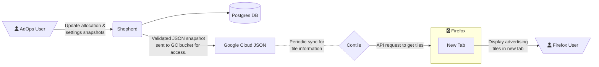

# Contextual Services Shepherd

## Service Overview

Shepherd is a Django application that allows users to make changes to Contile's advertising settings without redeploying Contile.
The settings managed here can be changed at runtime, eliminating the need for deployments of the services that use it.

Within Shepherd, users can make changes to Advertising Partners.
A given Partner can have multiple advertisers in numerous geolocations, each with their own distinct domain.
Users can also define partner allocation percentages for each tile position.
This means that given each Contile tile position, you can set the percentage of impressions that will show from each partner.

Once changes have been made and the user is ready to have these changes be effective in production, a user can create a “Snapshot.”
This records the settings and its values at that given point in time in the form of JSON.
Once published, Shepherd uploads a JSON file to Google Cloud Storage.
Contile will then pick up these changes in one of its 5 minute periodic check of the Google Cloud Storage bucket for an updated json file.

## Architecture

## Datastores
Shepherd's main datastore is a Postgres database that stores all partners, advertisers and snapshots.

All snapshots are uploaded as a JSON file to a Google Cloud bucket.
A pre-defined JSON schema validates the snapshot output prior to sending the snapshot to Google Cloud.
From there, Contile accesses the settings from the uploaded JSON file to serve Firefox users the correct advertising tiles in each new tab.

## Shepherd Service URLs:

Dev: https://shepherd-dev.topsites.nonprod.cloudops.mozgcp.net/admin/

Stage: https://shepherd-stage.topsites.nonprod.cloudops.mozgcp.net/admin/

Prod: https://shepherd.services.mozilla.com/admin/